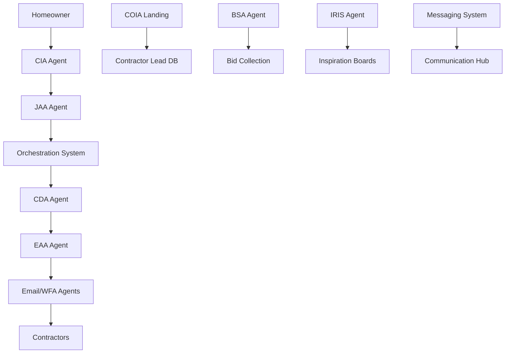

# InstaBids AI Agents Ecosystem - Complete System Map
**Last Updated**: August 26, 2025  
**Total Components**: 20+ Agents, Systems, and Utilities  
**Status**: Full ecosystem analysis and integration mapping - Intelligent Messaging System reorganized

## 🎯 Executive Summary

This document maps the complete InstaBids AI agent ecosystem. The system includes **standalone agents**, **coordinated service layers**, **utility systems**, and **integration handlers** that work together to manage the entire contractor-homeowner matching pipeline.

**Architecture Pattern**: Event-driven microservices with AI decision-making at each layer

## 🧠 **Unified Memory System - How Agents Save & Retrieve Conversations**

### **Two-Way Conversation Architecture**
All 20+ agents use a **unified 5-table memory system** that enables intelligent context sharing while maintaining agent independence.

#### **Method 1: Unified Conversation System (Standard)**
Most agents save conversations through the centralized API:
```python
# Standard conversation creation for all agents
POST /api/conversations/create
{
    "user_id": "user-123",
    "agent_type": "CIA",  # or IRIS, COIA, BSA, etc.
    "title": "Kitchen Remodel Discussion",
    "contractor_lead_id": "lead-456"  # For contractor agents
}

# All messages saved consistently 
POST /api/conversations/{id}/message
{
    "sender_type": "user",  # or "agent"
    "content": "I want to remodel my kitchen",
    "metadata": {"extracted_data": {...}}  # Agent-specific data
}
```

#### **Method 2: Agent-Specific State Systems (Special Cases)**
Some agents have specialized persistence:
- **COIA**: `save_coia_state()` for contractor profile persistence via `contractor_lead_id`
- **BSA**: LangGraph checkpointing + unified conversation system
- **IRIS**: Memory manager for image analysis and inspiration context

### **Smart Context Retrieval by Agent**

#### **CIA (Customer Interface Agent)**
- **Pulls**: Project history, budget preferences, timeline needs, communication style
- **Usage**: *"I remember your $15k budget for the kitchen project last month"*

#### **IRIS (Inspiration System)**  
- **Pulls**: Room analysis history, design preferences, style choices, inspiration boards
- **Usage**: *"Based on your modern farmhouse preference for the kitchen..."*

#### **COIA (Contractor Onboarding)**
- **Pulls**: Complete contractor profile (30+ fields), business research, conversation state
- **Usage**: *"Welcome back! I see you're JM Holiday Lighting from Deerfield Beach..."*

#### **BSA (Bid Submission Agent)**
- **Pulls**: Contractor profile, project requirements from CIA, previous bid history
- **Usage**: *"For this kitchen remodel, I know the homeowner prefers modern style..."*

#### **Cross-Agent Intelligence Examples**
- **CIA** references **IRIS** analysis: CIA can mention room preferences from IRIS sessions
- **BSA** uses **CIA** context: Contractors get project context from homeowner conversations  
- **Messaging System** analyzes with full context: Security filtering with complete conversation history

### **Memory System Benefits**
- **Return Visitor Recognition**: "Welcome back!" with full context restoration
- **Project Continuity**: Conversations resume exactly where they left off
- **Cross-Agent Learning**: Agents share intelligence across different interactions
- **Business Intelligence**: Complete user journey tracking across all 20+ agents

---

## 🏗️ System Architecture Overview



---

## 🤖 Core Agents (Standalone AI Systems)

### 1. **CIA** - Customer Interface Agent 
**Location**: `agents/cia/`  
**Status**: ✅ FULLY OPERATIONAL (GPT-5)  
**Purpose**: Homeowner conversation interface  
**Key Features**:
- GPT-5 powered conversations
- Potential bid card real-time tracking
- Service complexity classification
- Integration with JAA for bid card creation

**Files Analysis** (9 core files):
- `agent.py` - Main GPT-5 conversation logic ✅
- `potential_bid_card_integration.py` - Real-time bid card building ✅  
- `unified_integration.py` - Cross-system integration ✅
- `service_complexity_classifier.py` - Project complexity analysis ✅
- `mode_manager.py` - Conversation mode handling ✅
- `prompts.py`, `schemas.py`, `state.py`, `store.py` - Supporting infrastructure ✅

**Integration Points**:
```python
CIA → JAA: requests.post(f"/jaa/process/{thread_id}")
CIA → IRIS: Inspiration board integration
CIA → Potential Bid Cards: Real-time field tracking
```

### 2. **JAA** - Job Assessment Agent
**Location**: `agents/jaa/`  
**Status**: ✅ FULLY OPERATIONAL (Claude Opus 4)  
**Purpose**: Bid card creation and intelligent updates  
**Key Features**: (Already documented - see JAA README.md)

### 3. **BSA** - Bid Submission Agent  
**Location**: `agents/bsa/`  
**Status**: ✅ OPTIMIZED DEEPAGENTS (DeepAgents Framework)  
**Purpose**: Contractor bid submission and management  
**Key Features**:
- DeepAgents conversation framework
- LangGraph checkpointing for persistence
- Smart routing to 0-1 subagents based on intent
- Context caching (TTL: 1hr contractors, 30min memory, 15min bids)

**Performance Improvements**:
- **Before**: 15-45 seconds, 15+ DB queries
- **After**: 2-5 seconds, 2-5 DB queries

### 4. **CDA** - Contractor Discovery Agent
**Location**: `agents/cda/`  
**Status**: ✅ OPERATIONAL (Claude Opus 4 Intelligence)  
**Purpose**: Intelligent contractor matching and discovery  
**Key Features**:
- Claude Opus 4 for nuanced matching decisions
- Service-specific matching algorithms
- 3-tier contractor classification
- Web search integration for contractor discovery

**Component Architecture** (10+ files):
- `agent.py` - Main CDA coordinator ✅
- `service_specific_matcher.py` - Project-specific matching ✅
- `tier1_matcher_v2.py` - High-value contractor matching ✅  
- `tier2_reengagement.py` - Re-engagement campaigns ✅
- `web_search_agent.py` - Live contractor discovery ✅
- `email_discovery_agent.py` - Email extraction ✅

### 5. **COIA** - Contractor Onboarding Intelligence Agent
**Location**: `agents/coia/`  
**Status**: ✅ DEEPAGENTS FRAMEWORK  
**Purpose**: Contractor landing page onboarding  
**Key Features**:
- DeepAgents conversation framework
- 5 specialized subagents (identity, research, radius, projects, account)
- Google Business API integration
- Parallel agent orchestration

**Subagent Breakdown**:
- `identity_agent.py` - Company identification ✅
- `research_agent.py` - Business research ✅  
- `radius_agent.py` - Service area preferences ✅
- `projects_agent.py` - Project matching ✅
- `account_agent.py` - Account creation ✅

### 6. **IRIS** - Intelligent Room & Inspiration System
**Location**: `agents/iris/`  
**Status**: ✅ FULLY OPERATIONAL (Modular Architecture)  
**Purpose**: Photo analysis and design inspiration  
**Key Features**: (Already documented - see IRIS README.md)

### 7. **EAA** - External Acquisition Agent  
**Location**: `agents/eaa/`  
**Status**: ✅ MULTI-CHANNEL OUTREACH  
**Purpose**: Contractor outreach campaign execution  
**Key Features**:
- Multi-channel outreach (Email, SMS, Website Forms)
- Claude-powered email generation
- Response tracking and parsing
- Automated onboarding flows

**Channel Architecture**:
- `email_channel.py` - Email outreach ✅
- `mcp_email_channel_claude.py` - AI-powered email generation ✅
- `sms_channel.py` - SMS campaigns ✅
- `response_parser.py` - Response processing ✅

### 8. **CJA** - Contractor Job Agent
**Location**: `agents/cja/`  
**Status**: ⚠️ BASIC IMPLEMENTATION  
**Purpose**: Contractor-side job management  
**Note**: Simple implementation, may need expansion

---

## 🔧 Service Layers (Coordinated Systems)

### 1. **Orchestration System**
**Location**: `agents/orchestration/`  
**Status**: ✅ FULLY OPERATIONAL (8 components)  
**Purpose**: Campaign timing and execution coordination  
**Details**: (Already documented - see Orchestration README.md)

---

## 🛠️ Specialized Agents & Utilities

### 1. **WFA** - Website Form Automation Agent
**Location**: `agents/wfa/`  
**Status**: ✅ OPERATIONAL  
**Purpose**: Automated contractor website form submission  
**Key Features**:
- Playwright browser automation
- Form detection and submission
- Lead generation automation

### 2. **Email Extraction Agent**
**Location**: `agents/email_extraction/`  
**Status**: ✅ OPERATIONAL  
**Purpose**: Extract and process contractor emails  
**Integration**: Used by CDA and EAA for contractor communication

### 3. **Intelligent Messaging System**
**Location**: `agents/intelligent_messaging/` (organized folder structure)  
**Status**: ✅ FULLY OPERATIONAL (GPT-4o Security Analysis)  
**Purpose**: BUSINESS CRITICAL - Prevents contact information sharing and revenue loss  

**Core Components** (2 main files + documentation):
- `agent.py` - Main 1,243-line GPT-4o security analysis engine ✅
- `scope_change_handler.py` - Project scope change detection and bid card updates ✅  
- `README.md` - Complete system documentation ✅
- `__init__.py` - Package exports and integration points ✅

**Key Features**:
- **GPT-4o Security Analysis**: Advanced contact information detection (30+ bypass patterns)
- **LangGraph Workflow**: 5-node processing pipeline with intelligent routing
- **Multi-Format Security**: Handles TEXT, BID_SUBMISSION, IMAGE, DOCUMENT message types
- **Scope Change Intelligence**: Detects material, timeline, budget, feature changes
- **Revenue Protection**: Blocks contact circumvention attempts to maintain platform control

**Agent's "Lot of Jobs"** (Why it's business critical):
1. **Contact Information Filtering** - Prevents phone/email sharing
2. **Scope Change Detection** - Identifies project modifications  
3. **Bid Submission Security** - Filters contractor proposals
4. **Message Type Analysis** - Handles multiple content formats
5. **Threat Classification** - 5 security threat categories  
6. **Agent Comment Generation** - Contextual warnings and notifications
7. **Project Context Management** - Maintains bid card context across conversations

**Integration Points**:
```python
Messaging System → All Communications: Security filtering layer
CIA → Messaging: Homeowner message validation  
BSA → Messaging: Contractor bid submission filtering
JAA → Scope Handler: Bid card updates on scope changes
Admin Panel → Messaging: Security analysis dashboard
```

**Critical Business Impact**: This system is the primary defense against revenue loss - without it, contractors could bypass the platform by sharing direct contact information with homeowners.

---

## 🔍 Support Systems

### 1. **Enrichment System**
**Location**: `agents/enrichment/`  
**Status**: ✅ OPERATIONAL  
**Purpose**: Contractor data enrichment  
**Key Components**:
- `final_real_agent.py` - Main enrichment logic ✅
- `cda_integration.py` - CDA integration ✅

### 2. **Tracking Systems**
**Location**: `agents/tracking/`  
**Status**: ✅ OPERATIONAL  
**Purpose**: Bid distribution and response tracking  
**Component**: `bid_distribution_tracker.py` ✅

### 3. **Monitoring Systems**
**Location**: `agents/monitoring/`  
**Status**: ✅ OPERATIONAL  
**Purpose**: Response monitoring  
**Component**: `response_monitor.py` ✅

### 4. **Automation Systems**
**Location**: `agents/automation/`  
**Status**: ✅ OPERATIONAL  
**Purpose**: Follow-up automation  
**Component**: `followup_automation.py` ✅

---

## 📊 Agent Classification Summary

### **Full AI Agents** (Standalone with AI decision-making):
1. **CIA** - GPT-5 homeowner conversations ✅
2. **JAA** - Claude Opus 4 bid card intelligence ✅  
3. **BSA** - DeepAgents bid submission ✅
4. **CDA** - Claude Opus 4 contractor discovery ✅
5. **COIA** - DeepAgents contractor onboarding ✅
6. **IRIS** - Claude image analysis and inspiration ✅
7. **EAA** - Multi-channel outreach campaigns ✅
8. **Intelligent Messaging System** - GPT-4o security analysis (organized folder) ✅

### **Service Layers** (Coordinated component systems):
1. **Orchestration** - 8-component campaign management ✅

### **Specialized Agents** (Single-purpose automation):
1. **WFA** - Website form automation ✅
2. **Email Extraction** - Email processing ✅  
3. **CJA** - Contractor job management ⚠️

### **Utility Systems** (Supporting services):
1. **Enrichment** - Data enrichment ✅
2. **Tracking** - Bid distribution tracking ✅
3. **Monitoring** - Response monitoring ✅
4. **Automation** - Follow-up automation ✅

---

## 🔄 Data Flow & Integration Map

### **Primary Pipeline**: Homeowner → Contractor Matching
```
1. Homeowner → CIA (conversation)
2. CIA → JAA (bid card creation)  
3. JAA → Orchestration (campaign parameters)
4. Orchestration → CDA (contractor discovery)
5. CDA → EAA (outreach campaigns)
6. EAA → WFA/Email Agents (execution)
7. Contractors → BSA (bid submission)
```

### **Secondary Pipeline**: Contractor Onboarding  
```
1. Contractor → COIA (landing page)
2. COIA → 5 Subagents (parallel processing)
3. Subagents → Database (contractor profile)
4. Profile → CDA (available for matching)
```

### **Support Systems Integration**:
```
- Intelligent Messaging System: Comprehensive security filtering and scope change management
- IRIS Agent: Handles inspiration and photo analysis  
- Enrichment: Enhances contractor data quality
- Tracking/Monitoring: Performance analytics
```

---

## 🚨 Empty/Placeholder Folders

### **CHO** - `agents/cho/` 
**Status**: ❌ EMPTY FOLDER  
**Note**: Placeholder - no implementation

### **CRA** - `agents/cra/`
**Status**: ❌ EMPTY FOLDER  
**Note**: Placeholder - no implementation  

### **SMA** - `agents/sma/`
**Status**: ❌ EMPTY FOLDER  
**Note**: Placeholder - no implementation

---

## 💰 Cost Analysis by Agent

### **High-Cost Agents** (AI-Heavy):
- **CIA**: GPT-5 conversations (~$0.10-0.30 per conversation)
- **JAA**: Claude Opus 4 bid cards (~$0.05-0.15 per creation)  
- **CDA**: Claude Opus 4 matching (~$0.03-0.08 per discovery)
- **Intelligent Messaging System**: GPT-4o security analysis (~$0.02-0.05 per message)

### **Medium-Cost Agents**:
- **BSA**: DeepAgents framework (~$0.05-0.10 per submission)
- **COIA**: 5 subagents parallel processing (~$0.08-0.15 per onboarding)
- **IRIS**: Claude image analysis (~$0.05-0.12 per image)

### **Low-Cost Systems**:
- **EAA, WFA, Email Extraction**: Automation-heavy, minimal AI
- **Orchestration**: Logic-based coordination
- **All Utility Systems**: Database operations and monitoring

---

## 🎯 Recommended Next Deep Dives

Based on the comprehensive analysis, here are the most important backend systems to deep dive next:

### **Priority 1: Backend Core Systems**
1. **CDA (Contractor Discovery Agent)** - Core contractor matching intelligence
2. **EAA (External Acquisition Agent)** - Multi-channel outreach execution  
3. **WFA (Website Form Automation Agent)** - Critical for contractor lead generation

### **Priority 2: Communication Systems**
1. **Intelligent Messaging System** - Business-critical security and scope management (now well-organized)
2. **Email Extraction Agent** - Powers contractor communication

### **Priority 3: Contractor-Side Systems**  
1. **BSA (Bid Submission Agent)** - Contractor bid management
2. **COIA (Contractor Onboarding)** - Landing page conversions

**Recommendation**: Start with **CDA** as it's the brain of contractor discovery and directly feeds into the campaign system you just analyzed.

---

## 📈 System Health Status

**Fully Operational** (✅): 15+ agents/systems  
**Mostly Operational** (⚠️): 2 agents (CJA, minor issues)  
**Empty Placeholders** (❌): 3 folders (CHO, CRA, SMA)  

**Overall System Health**: 85%+ operational with full end-to-end workflow coverage

**The InstaBids AI ecosystem is a sophisticated multi-agent system with complete workflow automation from homeowner inquiry to contractor bid collection, powered by GPT-5, Claude Opus 4, and DeepAgents frameworks.**