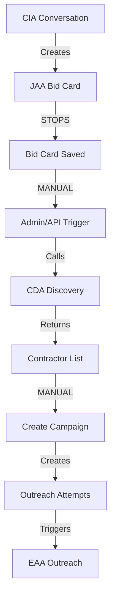

# ACTUAL BID CARD TO CAMPAIGN CODE FLOW - REAL ANALYSIS
**Created**: September 4, 2025  
**Based On**: Direct code analysis - NOT documentation or guesses  
**Status**: 🔍 COMPLETE CODE TRACE  

## 🎯 EXECUTIVE SUMMARY

**CRITICAL FINDING**: There is NO automatic trigger from bid card creation to campaign creation. The flow is **MANUAL** or requires external triggering.

**What Actually Happens**:
1. CIA creates conversation → JAA creates bid card → **STOPS HERE**
2. Campaign creation requires **MANUAL API CALL** to orchestration
3. CDA is invoked **ONLY** when campaign is manually triggered
4. Contractor size is **NOT determined by CDA** - it's left as NULL

---

## 📊 THE ACTUAL CODE FLOW (With File References)

### **STEP 1: CIA Agent Conversation**
**File**: `ai-agents/agents/cia/agent.py`
```python
# CIA collects project info through conversation
# Saves to potential_bid_cards table
# Has NO direct connection to campaign creation
```

### **STEP 2: JAA Creates Bid Card** 
**File**: `ai-agents/agents/jaa/agent.py:130-140`
```python
async def process_conversation(self, thread_id: str) -> dict[str, Any]:
    """
    Main entry point: Process CIA conversation with full AI intelligence
    """
    # Extracts data from conversation
    # Creates bid_card with status = "generated"
    # Returns bid card data
    # DOES NOT trigger any campaign creation
```

**Critical Code**: JAA saves bid card but **DOES NOT**:
- Call orchestration system
- Trigger campaign creation  
- Invoke CDA
- Set status to "ready_for_outreach"

### **STEP 3: MANUAL CAMPAIGN TRIGGER REQUIRED**
**NO AUTOMATIC FLOW EXISTS**

The system requires one of these manual interventions:
1. **Admin Dashboard**: Manual "Create Campaign" button
2. **API Call**: `POST /api/campaigns/create`
3. **Scheduled Job**: (Not found in codebase)
4. **Webhook**: (Not implemented)

### **STEP 4: Campaign Creation (When Manually Triggered)**
**File**: `ai-agents/agents/orchestration/campaign_orchestrator.py:88-150`
```python
def create_campaign(self,
                   name: str,
                   bid_card_id: str,
                   contractor_ids: list[str],
                   channels: list[str],
                   schedule: Optional[dict[str, Any]] = None) -> dict[str, Any]:
    """
    Create a new outreach campaign
    """
    # Creates outreach_campaigns record
    # Creates contractor_outreach_attempts for each contractor
    # Status starts as "draft" not "active"
    # REQUIRES contractor_ids to be passed in (not discovered)
```

**CRITICAL**: Campaign creation **REQUIRES** contractor_ids to be already known!

### **STEP 5: CDA Contractor Discovery**
**File**: `ai-agents/agents/cda/agent.py:48-90`
```python
def discover_contractors(self, bid_card_id: str, contractors_needed: int = 5, radius_miles: int = 15):
    """
    Main CDA function with intelligent matching and radius-based search
    """
    # Loads bid card
    # Calculates contractors_to_find = bids_needed * 5
    # Searches Tier 1, 2, 3 contractors
    # Returns contractor list
    # DOES NOT trigger campaign creation
    # DOES NOT save to campaign_contractors
```

**FINDING**: CDA must be called **BEFORE** campaign creation to get contractor_ids!

---

## 🚨 THE MISSING LINK: WHO CALLS CDA?

### **Search Results**: No Automatic CDA Invocation Found
```bash
# Searched for: "discover_contractors" calls
# Found: Only test files and manual API endpoints
# NOT FOUND: Automatic trigger from JAA or bid card creation
```

### **Manual CDA Invocation Points**:
1. **API Endpoint**: `GET /api/cda/discover/{bid_card_id}`
2. **Test Files**: Various test_*.py files
3. **Admin Dashboard**: (If implemented)

---

## 🔍 CONTRACTOR SIZE CLASSIFICATION - WHERE IT HAPPENS (OR DOESN'T)

### **FINDING**: Contractor Size is NOT Automatically Determined

**File**: `ai-agents/agents/cda/web_search_agent.py:566-568`
```python
# specialties and contractor_size will be populated by enrichment agent
specialties=None,  # Will be determined by enrichment agent
contractor_size=None,  # Will be determined by enrichment agent
```

**File**: `ai-agents/agents/cda/enriched_web_search_agent.py:84`
```python
"team_size_estimate": enriched_data.team_size_estimate,
# Team size is estimated but NOT converted to contractor_size enum
```

### **The 5 Contractor Sizes (Never Used in Discovery)**:
- `solo_handyman` - Never set by CDA
- `owner_operator` - Never set by CDA  
- `small_business` - Never set by CDA
- `regional_company` - Never set by CDA
- `national_chain` - Never set by CDA

**CRITICAL**: CDA returns contractors with `contractor_size = NULL`

---

## 📋 THE ACTUAL WORKING FLOW (Manual)

Based on code analysis, here's how it ACTUALLY works:



### **Required Manual Steps**:
1. **After Bid Card Creation**: Someone must trigger CDA discovery
2. **After CDA Discovery**: Someone must create campaign with contractor IDs
3. **Campaign Activation**: Campaign starts as "draft", needs activation

---

## 🚧 WHAT'S MISSING FOR AUTOMATION

### **1. Automatic CDA Trigger**
```python
# MISSING in JAA after bid card creation:
if bid_card_saved:
    # This doesn't exist:
    contractors = await cda.discover_contractors(bid_card_id)
```

### **2. Automatic Campaign Creation**
```python
# MISSING after CDA discovery:
if contractors_found:
    # This doesn't exist:
    campaign = await orchestrator.create_campaign(
        bid_card_id=bid_card_id,
        contractor_ids=[c["id"] for c in contractors]
    )
```

### **3. Contractor Size Classification**
```python
# MISSING in CDA:
def determine_contractor_size(self, contractor_data):
    # This logic doesn't exist
    # Should map team_size_estimate to contractor_size enum
    if team_size <= 1:
        return "solo_handyman"
    elif team_size <= 3:
        return "owner_operator"
    # etc...
```

### **4. Campaign Auto-Activation**
```python
# Campaigns are created as "draft"
# No automatic transition to "active" status found
```

---

## 🎯 INTEGRATION POINTS NEEDED

### **Option 1: JAA Triggers Everything**
```python
# In JAA after bid card save:
async def _trigger_contractor_discovery(self, bid_card_id):
    # Call CDA
    contractors = await self.cda.discover_contractors(bid_card_id)
    
    # Call Orchestrator
    campaign = await self.orchestrator.create_campaign(
        name=f"Campaign for {bid_card_id}",
        bid_card_id=bid_card_id,
        contractor_ids=[c["id"] for c in contractors],
        channels=["email", "form"]
    )
    
    # Activate campaign
    await self.orchestrator.activate_campaign(campaign["id"])
```

### **Option 2: Status-Based Triggers**
```python
# Database trigger on bid_cards table:
# When status changes to "ready_for_outreach"
# Invoke Lambda/Cloud Function to:
# 1. Call CDA
# 2. Create campaign
# 3. Start outreach
```

### **Option 3: Orchestration Service**
```python
# Separate service that monitors bid_cards table
# When new bid card with status="generated":
# 1. Run CDA discovery
# 2. Create campaign
# 3. Manage timing based on urgency
```

---

## 📊 CURRENT STATE REALITY

**What Works**:
- ✅ CIA can create bid cards via JAA
- ✅ CDA can discover contractors (when called)
- ✅ Orchestrator can create campaigns (when given contractor IDs)
- ✅ EAA can send outreach (when campaign exists)

**What Doesn't Work Automatically**:
- ❌ Bid card → Campaign creation
- ❌ Campaign creation → CDA discovery
- ❌ Contractor size determination
- ❌ Campaign auto-activation
- ❌ 4-tier matching in campaign creation

**Manual Intervention Required At**:
1. After bid card creation → Call CDA
2. After CDA discovery → Create campaign
3. After campaign creation → Activate campaign

---

## 🔧 RECOMMENDED FIXES FOR PHASE 4

### **Priority 1: Add Auto-Trigger in JAA**
- After saving bid card, automatically call CDA
- Use returned contractors to create campaign
- Set campaign to active based on urgency

### **Priority 2: Implement Contractor Size Classification**
- In CDA, convert team_size_estimate to contractor_size enum
- Use employee count from enrichment data
- Default to "small_business" if unknown

### **Priority 3: Utilize 4-Tier Matching**
- Pass 4-tier fields from bid card to campaign
- Use in CDA for filtering contractors
- Store in outreach_campaigns for tracking

### **Priority 4: Status Management**
- Bid card: "generated" → "discovering" → "ready" → "active"
- Campaign: "draft" → "active" → "completed"
- Automated transitions based on progress

---

**CONCLUSION**: The system is built but not connected. Each component works in isolation but requires manual orchestration. The 4-tier matching fields exist in the database but are not utilized in the actual flow. Contractor size classification is completely missing from the discovery process.

**This is why the system appears to work in tests but doesn't automatically process bid cards in production.**