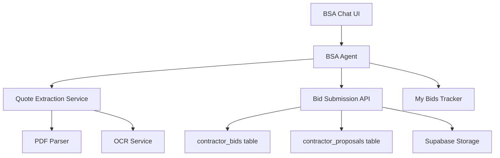

# BSA Bid Submission Integration - Product Requirements Document
**Version**: 1.0  
**Date**: September 4, 2025  
**Status**: In Development  
**Owner**: BSA Agent Team

## 🎯 Executive Summary

This PRD outlines the complete integration of bid submission capabilities directly into the BSA (Bid Submission Agent) chat interface. The system will enable contractors to discover bid cards, review project details, and submit bids without leaving the conversation - either through verbal descriptions or by uploading existing quotes from their CRM systems.

## 📋 Problem Statement

**Current Pain Points:**
1. Contractors must navigate away from BSA chat to submit bids
2. Manual re-entry of quote details from existing CRM documents
3. No intelligent extraction from uploaded proposals
4. Disconnected experience between bid discovery and submission

**Solution:**
An integrated chat experience where BSA helps contractors discover projects, analyze their quotes, and submit professional bids - all within a single conversational interface.

## 🎨 User Experience

### **Primary User Flow**

```
1. Contractor asks BSA: "Show me kitchen projects in my area"
2. BSA presents matching bid cards with inline preview
3. Contractor selects a project to view details (sidebar/modal)
4. Contractor says: "I want to bid on this"
5. BSA offers options: Verbal bid or Upload quote
6. If upload: BSA extracts and confirms details
7. If verbal: BSA guides through bid components
8. BSA submits bid and confirms success
```

### **UI Layout**

```
┌─────────────────────────────────────────────┐
│  BSA Chat Interface                         │
├──────────────────────┬──────────────────────┤
│                      │                      │
│   Chat Messages      │   Bid Card Panel     │
│                      │   (Slides out when   │
│   BSA: "Found 3      │    selected)         │
│   kitchen projects"  │                      │
│                      │   Project: Kitchen   │
│   [View] [View]      │   Budget: $45-60k    │
│   [View]             │   Timeline: 4 weeks  │
│                      │                      │
│   You: "I want to    │   [Submit Bid]       │
│   bid on #1"         │   [Upload Quote]     │
│                      │                      │
│   BSA: "Upload your  │   ┌──────────────┐   │
│   quote or describe" │   │ Drop PDF here│   │
│                      │   └──────────────┘   │
└──────────────────────┴──────────────────────┘
```

## 🔧 Technical Architecture

### **System Components**



### **Data Flow**

1. **Input Stage**: Chat message or file upload
2. **Processing Stage**: BSA analyzes intent and content
3. **Extraction Stage**: Parse documents for bid details
4. **Confirmation Stage**: Present extracted data for review
5. **Submission Stage**: Store bid and original documents
6. **Notification Stage**: Alert homeowner of new bid

## 📊 Functional Requirements

### **FR1: Bid Discovery in Chat**
- BSA must search and present relevant bid cards
- Bid cards must be clickable for detailed view
- Selected bid card context must persist in conversation

### **FR2: Verbal Bid Submission**
- BSA must guide contractors through bid components
- Required fields: Amount, Timeline, Materials, Approach
- Optional fields: Warranty, Payment terms, Milestones

### **FR3: Document Upload & Analysis**
- Support PDF, Word, Excel, and image formats
- Extract key bid information automatically
- Handle various CRM export formats

### **FR4: Intelligent Extraction**
```python
Extracted Fields:
- Total bid amount (required)
- Timeline/duration (required)
- Start date availability
- Materials included (yes/no)
- Labor costs breakdown
- Warranty terms
- Payment schedule
- Special conditions
- Contact information (filter out)
```

### **FR5: Bid Storage**
- Store structured bid data in database
- Save original uploaded documents
- Link bids to contractor and bid card
- Track submission method (verbal/upload)

### **FR6: Confirmation & Editing**
- Present extracted data for review
- Allow inline editing before submission
- Confirm all required fields are complete

## 🏗️ Implementation Plan

### **Phase 1: Backend Infrastructure (Week 1)**

#### **1.1 BSA Tool Functions**
```python
# agents/bsa/tools/bid_submission_tools.py

@tool
async def extract_quote_from_document(
    document: UploadFile,
    bid_card_context: dict
) -> dict:
    """Extract bid details from uploaded document"""
    
@tool
async def parse_verbal_bid(
    conversation: str,
    bid_card_id: str
) -> dict:
    """Parse bid details from conversation"""

@tool
async def validate_bid_completeness(
    bid_data: dict,
    requirements: dict
) -> tuple[bool, list[str]]:
    """Validate bid has all required fields"""

@tool
async def submit_contractor_bid(
    bid_data: dict,
    attachments: list[str]
) -> dict:
    """Submit bid to database"""
```

#### **1.2 Document Processing Service**
```python
# services/document_processor.py

class DocumentProcessor:
    async def extract_text_from_pdf(self, file: bytes) -> str:
        """Extract text from PDF using PyPDF2/pdfplumber"""
        
    async def extract_text_from_image(self, file: bytes) -> str:
        """OCR image using pytesseract/cloud service"""
        
    async def parse_crm_format(self, text: str) -> dict:
        """Parse common CRM export formats"""
```

#### **1.3 API Endpoints**
```python
# routers/bsa_bid_submission_api.py

@router.post("/bsa/analyze-quote")
async def analyze_quote(
    file: UploadFile,
    bid_card_id: str,
    contractor_id: str
):
    """Analyze uploaded quote document"""

@router.post("/bsa/submit-chat-bid")  
async def submit_bid_from_chat(
    bid_request: BidSubmissionRequest,
    chat_session_id: str
):
    """Submit bid from BSA chat session"""

@router.get("/bsa/bid-templates/{contractor_id}")
async def get_bid_templates(contractor_id: str):
    """Get contractor's previous bid templates"""
```

### **Phase 2: BSA Agent Enhancement (Week 1-2)**

#### **2.1 Update BSA State**
```python
# agents/bsa/bsa_deepagents.py

class BSADeepAgentState(TypedDict):
    messages: Annotated[list, add_messages]
    contractor_id: str
    contractor_context: dict
    my_bids_context: dict
    selected_bid_card: Optional[dict]  # NEW
    bid_submission_draft: Optional[dict]  # NEW
    uploaded_documents: Optional[list]  # NEW
```

#### **2.2 New Subagent: Bid Submission Assistant**
```python
bid_submission_subagent = Agent(
    name="bid-submission",
    instructions="""
    Help contractors submit professional bids by:
    1. Extracting details from uploaded quotes
    2. Guiding through verbal bid creation
    3. Ensuring all requirements are met
    4. Formatting professional proposals
    """,
    tools=[
        extract_quote_from_document,
        parse_verbal_bid,
        validate_bid_completeness,
        submit_contractor_bid
    ]
)
```

#### **2.3 Enhanced Router Logic**
```python
# agents/bsa/subagent_router.py

def route_to_bid_submission(state):
    """Route to bid submission when contractor wants to bid"""
    bid_triggers = [
        "want to bid",
        "submit a bid",
        "upload my quote",
        "here's my proposal",
        "i'll take this project"
    ]
    # Check for bid submission intent
```

### **Phase 3: Frontend Integration (Week 2)**

#### **3.1 Chat Component Enhancement**
```typescript
// components/bsa/BSAStreamingChat.tsx

interface BSAChatState {
  messages: Message[];
  selectedBidCard: BidCard | null;
  bidSubmissionMode: 'verbal' | 'upload' | null;
  extractedBidData: BidData | null;
}

const BSAStreamingChat: React.FC = () => {
  const [showBidPanel, setShowBidPanel] = useState(false);
  const [uploadedFile, setUploadedFile] = useState<File | null>(null);
  
  const handleBidCardSelect = (bidCard: BidCard) => {
    setSelectedBidCard(bidCard);
    setShowBidPanel(true);
  };
  
  const handleFileUpload = async (file: File) => {
    const extracted = await analyzeCRMQuote(file, selectedBidCard.id);
    setExtractedBidData(extracted);
  };
};
```

#### **3.2 Bid Submission Panel**
```typescript
// components/bsa/BidSubmissionPanel.tsx

const BidSubmissionPanel: React.FC<{
  bidCard: BidCard;
  onSubmit: (bid: BidData) => void;
}> = ({ bidCard, onSubmit }) => {
  return (
    <div className="bid-submission-panel">
      <BidCardSummary bidCard={bidCard} />
      <SubmissionMethodSelector />
      <FileUploadZone onUpload={handleUpload} />
      <ExtractedDataReview data={extractedData} />
      <BidConfirmation onConfirm={handleSubmit} />
    </div>
  );
};
```

### **Phase 4: Testing & Validation (Week 2-3)**

#### **4.1 Unit Tests**
```python
# tests/bsa/test_bid_submission.py

async def test_pdf_extraction():
    """Test extracting bid details from PDF"""
    
async def test_crm_format_parsing():
    """Test parsing various CRM formats"""
    
async def test_verbal_bid_parsing():
    """Test parsing bids from conversation"""
    
async def test_bid_validation():
    """Test bid completeness validation"""
```

#### **4.2 Integration Tests**
```python
# tests/bsa/test_bid_submission_integration.py

async def test_complete_upload_flow():
    """Test complete flow: upload -> extract -> confirm -> submit"""
    
async def test_complete_verbal_flow():
    """Test complete flow: chat -> parse -> confirm -> submit"""
    
async def test_notification_creation():
    """Test homeowner notifications are created"""
```

#### **4.3 End-to-End Tests**
```python
# tests/bsa/test_bid_submission_e2e.py

async def test_real_contractor_session():
    """Test with real contractor ID and bid card"""
    
async def test_real_pdf_samples():
    """Test with actual CRM export samples"""
    
async def test_concurrent_submissions():
    """Test multiple contractors submitting simultaneously"""
```

## 📈 Success Metrics

### **Primary Metrics**
- **Bid Submission Rate**: % of contractors who view bid cards that submit
- **Time to Submit**: Average time from bid card view to submission
- **Extraction Accuracy**: % of correctly extracted fields from uploads
- **Completion Rate**: % of started bids that get submitted

### **Secondary Metrics**
- **Upload vs Verbal**: Ratio of submission methods
- **Edit Rate**: % of extracted data that gets edited
- **Error Rate**: % of failed submissions
- **Document Types**: Distribution of uploaded formats

## 🚨 Security & Compliance

### **Security Requirements**
- Filter out contact information from uploads
- Validate contractor authorization for bid cards
- Sanitize uploaded documents for malicious content
- Rate limit submission attempts

### **Data Privacy**
- Store documents encrypted at rest
- Maintain audit trail of bid submissions
- Allow contractors to delete their uploads
- Comply with data retention policies

## 📝 Dependencies

### **External Libraries**
```python
# requirements.txt additions
PyPDF2==3.0.1  # PDF text extraction
pdfplumber==0.9.0  # Advanced PDF parsing
pytesseract==0.3.10  # OCR for images
python-multipart==0.0.6  # File upload handling
```

### **Database Schema**
```sql
-- New columns for contractor_bids
ALTER TABLE contractor_bids ADD COLUMN submission_method VARCHAR(50);
ALTER TABLE contractor_bids ADD COLUMN chat_session_id UUID;
ALTER TABLE contractor_bids ADD COLUMN extracted_from_upload BOOLEAN DEFAULT FALSE;

-- New table for document storage
CREATE TABLE bid_submission_documents (
    id UUID PRIMARY KEY,
    bid_id UUID REFERENCES contractor_bids(id),
    document_type VARCHAR(50),
    file_url TEXT,
    extracted_data JSONB,
    created_at TIMESTAMP DEFAULT NOW()
);
```

## 🎯 Definition of Done

### **Acceptance Criteria**
- [ ] Contractor can view bid cards within BSA chat
- [ ] Contractor can submit bid verbally through conversation
- [ ] Contractor can upload PDF/image quotes
- [ ] BSA correctly extracts 80%+ of bid details
- [ ] Extracted data is editable before submission
- [ ] Bids are stored in both tables (bids + proposals)
- [ ] Original documents are saved in storage
- [ ] Homeowner receives notification of new bid
- [ ] My Bids tracker updates with submission

### **Testing Checklist**
- [ ] Test with 5 different CRM export formats
- [ ] Test with handwritten quote images
- [ ] Test with multi-page PDF proposals
- [ ] Test verbal submission flow
- [ ] Test edit and resubmit flow
- [ ] Test concurrent submissions
- [ ] Test error handling for invalid files
- [ ] Test with real contractor accounts

## 📅 Timeline

**Week 1**: Backend infrastructure + BSA tools
**Week 2**: Frontend components + integration
**Week 3**: Testing + bug fixes + deployment

## 🔄 Post-Launch Iterations

### **V1.1 Enhancements**
- Auto-save draft bids
- Bid templates from previous submissions
- Bulk bid submission for multiple projects
- Comparative bid analysis

### **V2.0 Features**
- Voice input for verbal bids
- Smart pricing suggestions
- Competition analysis
- Win rate optimization

---

**This PRD will be updated as implementation progresses. All changes will be tracked in version history.**