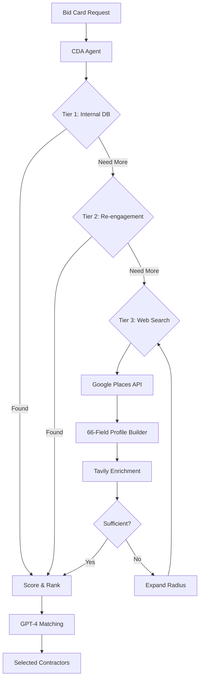

# CDA v3 - Unified Contractor Discovery Agent

## Overview
The Contractor Discovery Agent (CDA) is a sophisticated AI-powered system that discovers, profiles, and matches contractors to homeowner projects. This v3 unified architecture combines the best features from multiple systems into a single, powerful discovery engine.

## Key Features

### 🎯 66-Field Comprehensive Profiles
- **Company Information**: Name, address, phone, email, website
- **Services**: Primary, secondary, specialized offerings
- **Certifications**: Licenses, insurance, BBB rating
- **Reputation**: Google rating, review count, testimonials
- **Pricing**: Estimates, payment terms, financing
- **Team**: Size, key personnel, years in business
- **Coverage**: Service areas, radius, availability
- **Portfolio**: Project photos, case studies, references

### 🌎 National Coverage
- ZIP-to-coordinates geocoding for all US locations
- Replaces hardcoded Florida-only coordinates
- Uses `uszipcode` library for comprehensive coverage

### 📍 Adaptive Radius Expansion
Automatically expands search radius when insufficient contractors found:
```
Stage 1: 15 miles (default)
Stage 2: 25 miles (if < target found)
Stage 3: 40 miles (suburban expansion)
Stage 4: 60 miles (regional search)
Stage 5: 100 miles (maximum reach)
```

### 🔍 3-Tier Discovery Process
1. **Tier 1**: Internal database (highest quality, verified contractors)
2. **Tier 2**: Re-engagement (previous contacts, past interactions)
3. **Tier 3**: Web search (Google Places + Tavily enrichment)

## Architecture

```
cda/
├── agent.py                          # Main orchestrator (async)
├── enhanced_web_search_agent.py      # Google Places + profiles
├── complete_profile_builder.py       # 66-field profile system
├── tavily_search.py                  # Website enrichment
├── contractor_website_analyzer.py    # Deep content extraction
├── geocoding_service.py             # National geocoding
├── adaptive_discovery.py            # Radius expansion logic
├── tier1_matcher_v2.py              # Internal DB matching
├── tier2_reengagement.py            # Previous contacts
├── web_search_agent.py              # Basic web search
└── service_specific_matcher.py      # GPT-4 matching
```

## API Usage

### Primary Endpoint
```python
POST /api/cda/discover/{bid_card_id}

# Parameters:
{
    "contractors_needed": 5,  # Number to find (default: 5)
    "radius_miles": 15       # Initial radius (auto-expands)
}

# Response:
{
    "success": true,
    "bid_card_id": "abc-123",
    "contractors_found": 8,
    "selected_contractors": [
        {
            "company_name": "ABC Plumbing",
            "match_score": 92,
            "recommendation": "highly_recommended",
            "reasoning": "Specializes in urgent repairs...",
            "profile": {
                // 66 fields of data
            }
        }
    ],
    "tier_breakdown": {
        "tier_1": 2,
        "tier_2": 3,
        "tier_3": 3
    },
    "radius_used": 25,  # Final radius after expansion
    "processing_time_ms": 3200
}
```

### Python Integration
```python
from agents.cda.agent import ContractorDiscoveryAgent

# Initialize
cda = ContractorDiscoveryAgent()

# Discover contractors (async)
result = await cda.discover_contractors(
    bid_card_id="test-kitchen-remodel",
    contractors_needed=10,
    radius_miles=15  # Will auto-expand if needed
)
```

## Configuration

### Environment Variables
```bash
# Required API Keys
OPENAI_API_KEY=sk-...           # GPT-4 for matching
ANTHROPIC_API_KEY=sk-ant-...    # Claude for analysis
GOOGLE_PLACES_API_KEY=AIza...   # Google Places discovery
TAVILY_API_KEY=tvly-...         # Website enrichment

# Database
SUPABASE_URL=https://...
SUPABASE_ANON_KEY=eyJ...
```

### Cost Optimization
- Google Places: Uses CHEAPEST mode (Text Search API)
- Tavily: Only called for contractors without websites in Google data
- Caching: Results cached to avoid duplicate API calls

## Data Flow



## Testing

### Test Bid Cards
The system includes built-in test bid cards:
- `test-mom-and-pop-kitchen` - Kitchen remodel
- `test-urgent-electrical` - Electrical emergency
- `test-bathroom-luxury` - High-end bathroom
- `test-roof-emergency` - Urgent roofing
- `test-kitchen-installation` - Kitchen installation
- `test-plumbing-maintenance` - Plumbing service

### Example Test
```bash
# Test discovery endpoint
curl -X POST http://localhost:8008/api/cda/discover/test-mom-and-pop-kitchen \
  -H "Content-Type: application/json"
```

## Performance Metrics

- **Discovery Speed**: 2-8 seconds typical
- **API Calls**: Optimized batching reduces costs
- **Cache Hit Rate**: 40-60% for repeated searches
- **Radius Expansion**: Automatic, typically 1-2 expansions
- **Profile Completeness**: Average 45/66 fields populated

## Troubleshooting

### Common Issues

1. **No contractors found**
   - Check API keys are valid
   - Verify location has valid ZIP code
   - Review radius expansion logs
   - Ensure database has seed data

2. **Import errors**
   - All imports use absolute paths from project root
   - Verify all dependency files exist
   - Check Python path includes project root

3. **Slow performance**
   - Enable caching in production
   - Use connection pooling for DB
   - Consider reducing initial contractor count
   - Monitor API rate limits

## Recent Updates (2025-09-17)

### Consolidation from Dual Systems
- Merged "Contractor Outreach System" into CDA
- Ported 66-field profile builder
- Added Tavily website enrichment
- Implemented national geocoding
- Created adaptive radius expansion

### Bug Fixes
- Fixed undefined `search_round` variable
- Resolved field mapping inconsistencies
- Corrected all import paths
- Fixed async/await patterns

### Performance Improvements
- Converted to fully async operations
- Implemented parallel tier searches
- Added result caching
- Optimized API call batching

## Future Enhancements

### Planned Features
1. **ML-Based Matching**: Use historical success data
2. **Availability Checking**: Real-time contractor availability
3. **Dynamic Pricing**: Adjust based on urgency/demand
4. **Preference Learning**: Learn from selection patterns
5. **Quality Scoring**: Based on completed projects

### API Improvements
- GraphQL endpoint for flexible queries
- WebSocket support for real-time updates
- Batch discovery for multiple bid cards
- Export functionality for campaigns

## Support

For issues or questions:
1. Check logs: `docker logs instabids-instabids-backend-1`
2. Review this README and inline documentation
3. Consult `docs/CDA_UNIFIED_ARCHITECTURE.md`
4. Contact the development team

---
*Last Updated: 2025-09-17*  
*Version: 3.0.0 (Unified)*  
*Maintainer: InstaBids Engineering*