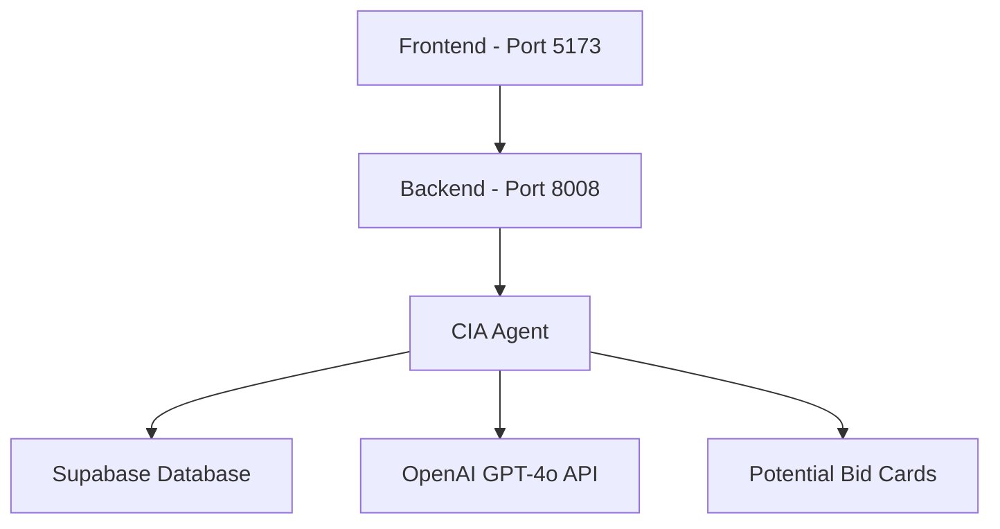

# CIA Agent - Complete System Integration Map
**Created**: August 29, 2025
**Purpose**: Document EVERY interaction point of the CIA agent with the entire system

## 🌐 COMPLETE SYSTEM OVERVIEW



## 🔌 API ENDPOINTS

### Main Entry Points (main.py)
```python
# Line 197: Main CIA router
app.include_router(cia_router, prefix="/api/cia")

# Line 198: Potential bid cards router  
app.include_router(cia_potential_bid_cards_router, prefix="/api/cia")

# Line 199: Image upload router
app.include_router(cia_image_router)
```

### CIA Routes (`routers/cia_routes_unified.py`)
| Endpoint | Method | Purpose | Line |
|----------|--------|---------|------|
| `/api/cia/opening-message` | GET | Get opening message | 216 |
| `/api/cia/conversation/{session_id}` | GET | Get conversation history | 225 |
| `/api/cia/stream` | POST | Main chat endpoint (streaming) | 282 |
| `/api/cia/chat/rfi/{rfi_id}` | POST | RFI photo context | 804 |
| `/api/cia/receive-iris-proposal` | POST | IRIS integration | 837 |

### Potential Bid Cards Routes (`routers/cia_potential_bid_cards.py`)
| Endpoint | Method | Purpose | Line |
|----------|--------|---------|------|
| `/api/cia/potential-bid-cards` | POST | Create bid card | 90 |
| `/api/cia/potential-bid-cards/{id}/field` | PUT | Update field | 164 |
| `/api/cia/potential-bid-cards/{id}` | GET | Get bid card | 221 |
| `/api/cia/user/{user_id}/potential-bid-cards` | GET | User's cards | 278 |
| `/api/cia/conversation/{id}/potential-bid-card` | GET | Conv card | 315 |
| `/api/cia/potential-bid-cards/{id}/convert-to-bid-card` | POST | Convert | 341 |
| `/api/cia/potential-bid-cards/{id}` | DELETE | Delete card | 607 |

## 🎨 FRONTEND COMPONENTS

### Active Components Using CIA
1. **`UltimateCIAChat.tsx`** - Main consolidated chat component (850 lines)
   - Location: `web/src/components/chat/`
   - Calls: `/api/cia/stream` for conversations
   - Features: WebRTC voice, phase tracking, bid cards

2. **`HomePage.tsx`** - Main landing page
   - Uses: `<UltimateCIAChat />`
   - Route: `/` (root)

3. **`DynamicBidCardPreview.tsx`** - Real-time bid card display
   - Polls: `/api/cia/potential-bid-cards/{id}`
   - Updates every 2 seconds

### Archived Components (in `web/src/components/chat/archive/`)
- CIAChat.tsx (original)
- UltraInteractiveCIAChat.tsx
- DynamicCIAChat.tsx
- RealtimeCIAChat.tsx

## 🔧 INITIALIZATION FLOW

### 1. Server Startup (`main.py`)
```python
# Lines 166-183: CIA Agent Initialization
openai_api_key = os.getenv("OPENAI_API_KEY")
if openai_api_key:
    cia_agent = CustomerInterfaceAgent(openai_api_key)
    set_cia_agent(cia_agent)  # Sets global agent instance
    logger.info("CIA agent initialized successfully")
```

### 2. Agent Creation (`agents/cia/agent.py`)
```python
class CustomerInterfaceAgent:
    def __init__(self, api_key: Optional[str] = None):
        self.api_key = api_key or os.getenv("OPENAI_API_KEY")
        self.client = AsyncOpenAI(api_key=self.api_key)
        self.db = db  # database_simple instance
        self.bid_cards = PotentialBidCardManager()
        self.store = CIAStore()
```

## 🔑 API KEY FLOW

### Environment Variables Chain
1. **Docker Compose** (`docker-compose.yml`)
   ```yaml
   environment:
     - OPENAI_API_KEY=${OPENAI_API_KEY}
   ```

2. **Local .env File**
   ```
   OPENAI_API_KEY=sk-proj-ku2G1hDBgTcAd2oHf1PIs...
   ```

3. **Runtime Loading**
   ```python
   # main.py:166
   openai_api_key = os.getenv("OPENAI_API_KEY")
   
   # agent.py:27
   self.api_key = api_key or os.getenv("OPENAI_API_KEY")
   ```

## 💾 DATABASE INTERACTIONS

### Tables Used
1. **`unified_conversations`** - Main conversation storage
2. **`unified_messages`** - Individual messages
3. **`potential_bid_cards`** - Real-time bid card data
4. **`bid_cards`** - Converted official bid cards

### Database Flow
```python
# agent.py:138 - Load conversation
conversation_state = await self.db.load_conversation_state(session_id)

# agent.py:198 - Save conversation
await self.db.save_unified_conversation({...})

# agent.py:209 - Additional save
await self.store.save_conversation_turn(...)
```

## 🔄 REQUEST FLOW (Complete Journey)

### 1. User Types in Chat (Frontend)
```typescript
// UltimateCIAChat.tsx
const response = await fetch('/api/cia/stream', {
    method: 'POST',
    body: JSON.stringify({
        message: userMessage,
        session_id: sessionId,
        user_id: userId
    })
})
```

### 2. Router Receives Request
```python
# cia_routes_unified.py:282
@router.post("/stream")
async def stream_cia_response(request: CIARequest):
    result = await cia_agent.handle_conversation(...)
```

### 3. Agent Processes
```python
# agent.py:102-230
async def handle_conversation(...):
    # Load context
    # Get/create bid card
    # Call OpenAI
    # Update bid card
    # Save to database
    # Return response
```

### 4. OpenAI Tool Calling
```python
# agent.py:149
response = await self.client.chat.completions.create(
    model="gpt-4o",
    messages=messages,
    tools=self.tools,  # update_bid_card tool
    tool_choice="auto"
)
```

### 5. Bid Card Updates
```python
# agent.py:173-182
for field_name, field_value in bid_card_fields.items():
    success = await self.bid_cards.update_bid_card_field(
        bid_card_id=bid_card_id,
        field_name=field_name,
        field_value=field_value
    )
```

### 6. Response Returns to UI
```typescript
// UltimateCIAChat.tsx
setMessages([...messages, {
    role: 'assistant',
    content: response.response
}])
// Bid card updates automatically via polling
```

## 🧪 TESTING & VERIFICATION

### How to Verify CIA is Working
```bash
# 1. Check if agent is initialized
curl http://localhost:8008/api/cia/opening-message

# 2. Test chat endpoint
curl -X POST http://localhost:8008/api/cia/stream \
  -H "Content-Type: application/json" \
  -d '{"message": "I need help with my kitchen", "session_id": "test-001"}'

# 3. Check Docker logs
docker logs instabids-instabids-backend-1 | grep "CIA agent initialized"

# 4. Run integration test
docker-compose exec instabids-backend python tests/cia/test_conversation_continuity.py
```

### Common Issues & Solutions
| Issue | Check | Solution |
|-------|-------|----------|
| No response | API key loaded? | Check `OPENAI_API_KEY` in Docker |
| No bid card | PotentialBidCardManager working? | Check Supabase connection |
| No memory | Database connected? | Verify `SUPABASE_URL` and `SUPABASE_KEY` |
| Wrong prompt | Using UNIFIED_PROMPT_FINAL? | Check agent.py:269 |

## 📊 MONITORING POINTS

### Key Log Messages
```python
# Successful initialization
"CIA agent initialized successfully with OpenAI GPT-5 API key"

# API call
"Calling OpenAI GPT-4o with extraction tool"

# Bid card creation
"Created potential bid card: {bid_card_id}"

# Field updates
"Updated bid card field {field_name}: {field_value}"

# Memory save
"Loaded {len(previous_messages)} previous messages for session {session_id}"
```

### Database Queries for Verification
```sql
-- Check conversations
SELECT * FROM unified_conversations 
WHERE conversation_type = 'CIA' 
ORDER BY created_at DESC LIMIT 5;

-- Check bid cards
SELECT * FROM potential_bid_cards 
ORDER BY created_at DESC LIMIT 5;

-- Check messages
SELECT * FROM unified_messages 
WHERE conversation_id LIKE 'cia_%' 
ORDER BY created_at DESC LIMIT 10;
```

## 🚨 CRITICAL DEPENDENCIES

1. **OpenAI API Key** - Must be valid and have GPT-4o access
2. **Supabase Connection** - URL and anon key must be correct
3. **Docker Network** - Backend must be accessible on port 8008
4. **Frontend Build** - UltimateCIAChat.tsx must be compiled

## 📝 SUMMARY

The CIA agent is deeply integrated across:
- **7 API endpoints** for chat and bid cards
- **1 main UI component** (UltimateCIAChat)
- **4 database tables** for persistence
- **3 routers** for different functionalities
- **Multiple initialization points** in main.py

This map shows EVERY connection point. The agent cannot function without ALL these pieces working together.