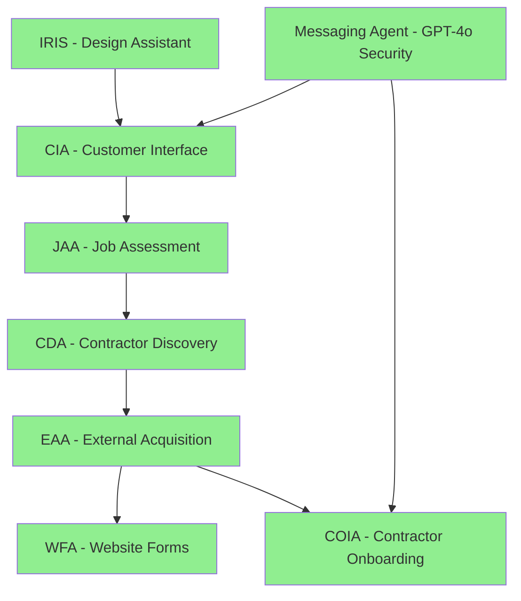

# InstaBids Agent System - Complete Index

## Overview
This document provides a comprehensive index of all agents in the InstaBids system, including both fully documented agents and those requiring documentation updates.

## Fully Documented Agents (7 Agents with Complete READMEs)

### 1. CIA - Customer Interface Agent
- **Location**: `ai-agents/agents/cia/`
- **Documentation**: `CIA-CustomerInterfaceAgent.md`
- **Purpose**: Handles homeowner conversations for project scoping
- **Technology**: Claude Opus 4, LangGraph, Multi-project memory
- **Status**: ✅ FULLY OPERATIONAL

### 2. JAA - Job Assessment Agent 
- **Location**: `ai-agents/agents/jaa/`
- **Documentation**: `JAA-JobAssessmentAgent.md`
- **Purpose**: Processes CIA conversations to generate bid cards
- **Technology**: Claude Opus 4, LangGraph workflow orchestration
- **Status**: ✅ FULLY OPERATIONAL

### 3. CDA - Contractor Discovery Agent
- **Location**: `ai-agents/agents/cda/`
- **Documentation**: `CDA-ContractorDiscoveryAgent.md`
- **Purpose**: 3-tier contractor discovery and matching system
- **Technology**: Claude Opus 4, Google Places API, Web scraping
- **Status**: ✅ FULLY OPERATIONAL

### 4. EAA - External Acquisition Agent
- **Location**: `ai-agents/agents/eaa/`
- **Documentation**: `EAA-ExternalAcquisitionAgent.md`
- **Purpose**: Multi-channel contractor outreach campaigns
- **Technology**: Claude-enhanced personalization, MCP email tools
- **Status**: ✅ FULLY OPERATIONAL

### 5. COIA - Contractor Interface Agent
- **Location**: `ai-agents/agents/coia/`
- **Documentation**: `COIA-ContractorInterfaceAgent.md`
- **Purpose**: Contractor onboarding and profile creation
- **Technology**: Claude Opus 4, Supabase auth integration
- **Status**: ✅ FULLY OPERATIONAL

### 6. WFA - Website Form Automation Agent
- **Location**: `ai-agents/agents/wfa/`
- **Documentation**: `WFA-WebsiteFormAutomationAgent.md`
- **Purpose**: Automated contractor website form filling
- **Technology**: Playwright browser automation, Form intelligence
- **Status**: ✅ FULLY OPERATIONAL

### 7. IRIS - Design Inspiration Assistant
- **Location**: `ai-agents/agents/iris/`
- **Documentation**: `IRIS-DesignInspirationAssistant.md`
- **Purpose**: Design inspiration organization and guidance
- **Technology**: Claude 3.7 Sonnet (most intelligent model)
- **Status**: ✅ FULLY OPERATIONAL

## Additional Agents Without Documentation (11 Agent Directories)

### 8. CHO - Contractor Handoff Agent (?)
- **Location**: `ai-agents/agents/cho/`
- **Documentation**: ❌ No README found
- **Files Found**: Directory exists but no documentation
- **Purpose**: Likely handles contractor transition/handoff
- **Status**: ⚠️ NEEDS DOCUMENTATION

### 9. CJA - Contractor Jobs Agent (?)
- **Location**: `ai-agents/agents/cja/`
- **Documentation**: ❌ No README found
- **Files Found**: Directory exists but no documentation
- **Purpose**: Possibly manages contractor job assignments
- **Status**: ⚠️ NEEDS DOCUMENTATION

### 10. CRA - Contractor Retention Agent (?)
- **Location**: `ai-agents/agents/cra/`
- **Documentation**: ❌ No README found
- **Files Found**: Directory exists but no documentation
- **Purpose**: Likely focuses on contractor retention
- **Status**: ⚠️ NEEDS DOCUMENTATION

### 11. SMA - Social Media Agent (?)
- **Location**: `ai-agents/agents/sma/`
- **Documentation**: ❌ No README found
- **Files Found**: Directory exists but no documentation
- **Purpose**: Possibly handles social media outreach
- **Status**: ⚠️ NEEDS DOCUMENTATION

### 12. Automation Agent
- **Location**: `ai-agents/agents/automation/`
- **Documentation**: ❌ No README found
- **Files Found**: Directory exists but no documentation
- **Purpose**: General automation tasks
- **Status**: ⚠️ NEEDS DOCUMENTATION

### 13. Email Extraction Agent
- **Location**: `ai-agents/agents/email_extraction/`
- **Documentation**: ❌ No README found
- **Files Found**: Directory exists but no documentation
- **Purpose**: Email address extraction and discovery
- **Status**: ⚠️ NEEDS DOCUMENTATION

### 14. Enrichment Agent
- **Location**: `ai-agents/agents/enrichment/`
- **Documentation**: ❌ No README found
- **Files Found**: Directory exists but no documentation
- **Purpose**: Data enrichment and profile enhancement
- **Status**: ⚠️ NEEDS DOCUMENTATION

### 15. Monitoring Agent
- **Location**: `ai-agents/agents/monitoring/`
- **Documentation**: ❌ No README found
- **Files Found**: Directory exists but no documentation
- **Purpose**: System monitoring and health checks
- **Status**: ⚠️ NEEDS DOCUMENTATION

### 16. Orchestration Agent
- **Location**: `ai-agents/agents/orchestration/`
- **Documentation**: ❌ No README found
- **Files Found**: Directory exists but no documentation
- **Purpose**: Workflow orchestration and coordination
- **Status**: ⚠️ NEEDS DOCUMENTATION

### 17. Tracking Agent
- **Location**: `ai-agents/agents/tracking/`
- **Documentation**: ❌ No README found
- **Files Found**: Directory exists but no documentation
- **Purpose**: Progress and metrics tracking
- **Status**: ⚠️ NEEDS DOCUMENTATION

### 18. Messaging Agent (Intelligent & Basic Systems)
- **Location**: `ai-agents/agents/`
- **Files**: `messaging_agent.py`, `intelligent_messaging_agent.py`
- **Documentation**: `COMPLETE_MESSAGING_AGENT_DOCUMENTATION.md`
- **Purpose**: GPT-4o powered security analysis, scope change detection, contact filtering
- **Technology**: GPT-4o analysis, LangGraph workflows, Supabase integration
- **Status**: ✅ FULLY OPERATIONAL - VERIFIED WITH REAL TESTING

## Special Agent Files

### Scope Change Handler
- **Location**: `ai-agents/agents/scope_change_handler.py`
- **Purpose**: Handles project scope modifications
- **Status**: ⚠️ Needs integration documentation

### Consultants Directory
- **Location**: `ai-agents/consultants/`
- **Has README**: Yes
- **Purpose**: Consultant management system
- **Status**: ℹ️ Separate system

## Summary Statistics

- **Total Agent Directories**: 18
- **Fully Operational Agents**: 8 (with complete documentation and verified testing)
- **Agents Needing Documentation**: 10
- **Special Agent Systems**: 2

## Documentation Status

### ✅ Fully Operational & Documented (8)
1. CIA - Customer Interface Agent
2. JAA - Job Assessment Agent
3. CDA - Contractor Discovery Agent
4. EAA - External Acquisition Agent
5. COIA - Contractor Interface Agent
6. WFA - Website Form Automation
7. IRIS - Design Inspiration Assistant
8. Messaging Agent - Intelligent message filtering and routing

### ⚠️ Need Documentation (10)
1. CHO - Contractor Handoff Agent
2. CJA - Contractor Jobs Agent
3. CRA - Contractor Retention Agent
4. SMA - Social Media Agent
5. Automation Agent
6. Email Extraction Agent
7. Enrichment Agent
8. Monitoring Agent
9. Orchestration Agent
10. Tracking Agent

## Agent Interaction Map

## Recommendations

1. **Priority 1**: Document the 10 remaining agents without READMEs
2. **Priority 2**: Verify if undocumented agents are active or deprecated
3. **Priority 3**: Create unified agent architecture documentation
4. **Priority 4**: Establish agent documentation standards
5. **Priority 5**: Implement automated documentation generation

## Notes

- All documented agents use Claude Opus 4 or Claude 3.7 Sonnet
- Most agents integrate with Supabase for data persistence
- Several agents have duplicate implementations that need consolidation
- The messaging system is documented separately in system docs

---

**Last Updated**: August 12, 2025
**Updated By**: Claude Agent 6
**Documentation Location**: `/docs/actual-agents/`