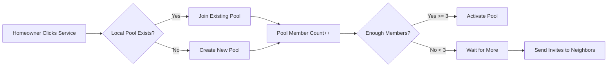

# Quick-Start Group Bidding System Design
**Created**: January 19, 2025  
**Status**: Design & Architecture Phase
**Purpose**: Enable instant group bidding through pre-defined popular service categories

---

## 🎯 CONCEPT OVERVIEW

Instead of complex group formation flows, we provide a **"Popular Services"** tab with 10-15 pre-defined services that homeowners can instantly join. Think of it like "Group Buying for Home Services" - click, join, save.

**Core Insight**: Most homeowners need the same recurring services. By pre-defining these, we eliminate friction and enable instant group formation.

---

## 🏠 PRE-DEFINED SERVICE CATEGORIES

### **Tier 1: Recurring Services** (Highest Group Potential)
1. **🌱 Lawn Care Service** 
   - Weekly/bi-weekly mowing
   - Fertilization programs
   - Weed control
   - Target: $100-200/month

2. **💧 Pool Service**
   - Weekly cleaning
   - Chemical balancing
   - Equipment maintenance
   - Target: $150-300/month

3. **🎄 Holiday Lighting**
   - Installation & removal
   - Storage options
   - Seasonal (Nov-Jan)
   - Target: $500-2000/season

4. **🍂 Gutter Cleaning**
   - Quarterly service
   - Downspout clearing
   - Inspection included
   - Target: $150-300/service

5. **💦 Pressure Washing**
   - Driveway & sidewalks
   - House exterior
   - Annual/bi-annual
   - Target: $200-500/service

### **Tier 2: One-Time Projects** (Medium Group Potential)
6. **🏠 Roof Replacement**
   - Shingle replacement
   - Full tear-off
   - 20-30 year warranty
   - Target: $8,000-15,000

7. **🌿 Artificial Turf Installation**
   - Full lawn conversion
   - Pet-friendly options
   - 10-15 year warranty
   - Target: $5,000-12,000/yard

8. **❄️ AC Replacement**
   - Central air units
   - Energy efficient models
   - Installation included
   - Target: $5,000-10,000

9. **🪟 Window Replacement**
   - Energy efficient windows
   - Full house packages
   - Installation included
   - Target: $8,000-20,000

10. **🎨 House Painting**
    - Exterior painting
    - Prep & primer included
    - 5-year warranty
    - Target: $3,000-8,000

### **Tier 3: Specialty Services** (Niche Group Potential)
11. **🌳 Tree Trimming**
    - Annual trimming
    - Hazard removal
    - Licensed arborists
    - Target: $500-2000/service

12. **🐜 Pest Control**
    - Quarterly treatments
    - Termite protection
    - Eco-friendly options
    - Target: $100-200/quarter

13. **🏊 Pool Resurfacing**
    - Plaster/pebble finish
    - Tile replacement
    - Equipment upgrades
    - Target: $5,000-15,000

14. **🚪 Garage Door Replacement**
    - New door & opener
    - Smart home integration
    - Installation included
    - Target: $1,500-4,000

15. **☀️ Solar Panel Installation**
    - Full system design
    - Permits included
    - Net metering setup
    - Target: $15,000-30,000

---

## 💾 DATABASE ARCHITECTURE

### **New Tables Needed**

#### 1. `group_bidding_categories`
```sql
CREATE TABLE group_bidding_categories (
  id UUID PRIMARY KEY DEFAULT uuid_generate_v4(),
  category_code VARCHAR(50) UNIQUE NOT NULL, -- 'lawn_care', 'pool_service', etc.
  display_name VARCHAR(100) NOT NULL,
  description TEXT,
  service_type VARCHAR(20), -- 'recurring', 'one_time', 'seasonal'
  frequency VARCHAR(50), -- 'weekly', 'monthly', 'quarterly', 'annual'
  typical_price_min DECIMAL(10,2),
  typical_price_max DECIMAL(10,2),
  icon_name VARCHAR(50), -- For UI display
  sort_order INTEGER,
  is_active BOOLEAN DEFAULT true,
  service_complexity VARCHAR(50) DEFAULT 'single-trade',
  primary_trade VARCHAR(100),
  group_discount_tiers JSONB, -- {"3": 0.15, "6": 0.20, "11": 0.25}
  created_at TIMESTAMP DEFAULT NOW()
);
```

#### 2. `group_bidding_pools`
```sql
CREATE TABLE group_bidding_pools (
  id UUID PRIMARY KEY DEFAULT uuid_generate_v4(),
  category_id UUID REFERENCES group_bidding_categories(id),
  zip_code VARCHAR(10) NOT NULL,
  city VARCHAR(100),
  state VARCHAR(50),
  pool_status VARCHAR(50) DEFAULT 'forming', -- 'forming', 'active', 'closed', 'fulfilled'
  member_count INTEGER DEFAULT 0,
  target_member_count INTEGER DEFAULT 3,
  start_date DATE,
  end_date DATE,
  estimated_savings_percentage DECIMAL(5,2),
  actual_bid_card_id UUID REFERENCES bid_cards(id), -- Created when pool activates
  created_at TIMESTAMP DEFAULT NOW(),
  activated_at TIMESTAMP,
  closed_at TIMESTAMP,
  
  UNIQUE(category_id, zip_code, start_date) -- One pool per category per ZIP per period
);
```

#### 3. `group_pool_members`
```sql
CREATE TABLE group_pool_members (
  id UUID PRIMARY KEY DEFAULT uuid_generate_v4(),
  pool_id UUID REFERENCES group_bidding_pools(id),
  user_id UUID REFERENCES users(id),
  homeowner_id UUID REFERENCES homeowners(id),
  join_status VARCHAR(50) DEFAULT 'interested', -- 'interested', 'committed', 'confirmed', 'withdrawn'
  property_address TEXT,
  property_details JSONB, -- Square footage, specific needs
  preferred_schedule JSONB, -- Days/times available
  budget_range JSONB, -- Personal budget preferences
  joined_at TIMESTAMP DEFAULT NOW(),
  committed_at TIMESTAMP,
  withdrawn_at TIMESTAMP,
  withdrawal_reason TEXT
);
```

#### 4. `group_pool_invitations`
```sql
CREATE TABLE group_pool_invitations (
  id UUID PRIMARY KEY DEFAULT uuid_generate_v4(),
  pool_id UUID REFERENCES group_bidding_pools(id),
  inviter_user_id UUID REFERENCES users(id),
  invitee_email VARCHAR(255),
  invitee_phone VARCHAR(20),
  invitation_code VARCHAR(50) UNIQUE,
  invitation_status VARCHAR(50) DEFAULT 'pending', -- 'pending', 'accepted', 'declined', 'expired'
  sent_at TIMESTAMP DEFAULT NOW(),
  accepted_at TIMESTAMP,
  expires_at TIMESTAMP DEFAULT NOW() + INTERVAL '7 days'
);
```

---

## 🎨 UI/UX DESIGN

### **Homepage Integration**
```typescript
// New tab on homeowner dashboard
<Tabs>
  <Tab label="My Projects" />
  <Tab label="Popular Services" badge="Save 15-25%!" /> // NEW
  <Tab label="Messages" />
  <Tab label="Contractors" />
</Tabs>
```

### **Popular Services Tab Layout**
```typescript
interface ServiceCard {
  category: GroupBiddingCategory;
  localPool: GroupBiddingPool | null;
  memberCount: number;
  potentialSavings: string; // "Save $30-50/month"
  nextGroupStarts: Date;
  spotsRemaining: number;
}

// Grid layout with service cards
<Grid columns={3}>
  {services.map(service => (
    <ServiceCard
      icon={service.icon}
      title={service.displayName}
      description={service.description}
      priceRange={`$${service.typicalPriceMin}-${service.typicalPriceMax}`}
      localPoolStatus={
        service.localPool 
          ? `${service.memberCount}/5 neighbors joined`
          : "Be the first in your area!"
      }
      savingsBadge={
        service.memberCount >= 3 
          ? `Save ${calculateDiscount(service.memberCount)}%`
          : "Need 2 more for group discount"
      }
      action={
        service.localPool
          ? <Button>Join Group</Button>
          : <Button>Start Group</Button>
      }
    />
  ))}
</Grid>
```

### **Quick Join Flow**
```typescript
// One-click join process
const handleQuickJoin = async (categoryId: string) => {
  // 1. Check for existing local pool
  const localPool = await findLocalPool(categoryId, userZipCode);
  
  if (localPool) {
    // 2a. Join existing pool
    await joinPool(localPool.id, userId);
    showNotification("You've joined 4 neighbors for group lawn care!");
  } else {
    // 2b. Create new pool
    const newPool = await createPool(categoryId, userZipCode);
    await joinPool(newPool.id, userId);
    showNotification("Group started! We'll notify you when 2 more neighbors join.");
  }
  
  // 3. Optional: Collect specific preferences
  showPreferencesModal({
    preferredDays: ["Monday", "Tuesday", "Wednesday"],
    propertySize: "5000-10000 sqft",
    specialRequests: "Gate code: 1234"
  });
};
```

---

## 🔄 COMPLETE SYSTEM FLOW

### **Phase 1: Pool Formation** (Day 1-7)


### **Phase 2: Pool Activation** (Day 7-10)
```javascript
// When pool reaches minimum members
const activatePool = async (poolId: string) => {
  // 1. Create group bid card
  const bidCard = await createGroupBidCard({
    pool_id: poolId,
    category: pool.category,
    member_addresses: pool.members.map(m => m.address),
    group_size: pool.memberCount,
    service_complexity: 'single-trade',
    urgency: 'flexible', // Groups can wait for best pricing
  });
  
  // 2. Trigger GroupBiddingAgent
  const groupingResult = await GroupBiddingAgent.execute({
    bid_card_id: bidCard.id,
    clustering_parameters: {
      preferred_service_complexity: 'single-trade',
      min_group_size: pool.memberCount,
      min_savings_threshold: 0.15
    }
  });
  
  // 3. Launch contractor discovery
  await CDAAgent.discoverContractors({
    bid_card_id: bidCard.id,
    service_type: pool.category.primary_trade,
    location: pool.zip_code,
    group_size: pool.memberCount
  });
};
```

### **Phase 3: Contractor Bidding** (Day 10-14)
```javascript
// Contractors see group opportunities
const groupBidInterface = {
  title: "Group Opportunity: 5 Homes - Lawn Care",
  locations: ["123 Main St", "125 Main St", "127 Main St", "129 Main St", "131 Main St"],
  totalValue: "$500-750/month recurring",
  requirements: "Weekly service, all properties same day",
  benefits: [
    "Guaranteed 5 properties",
    "Efficient route (all same street)",
    "12-month commitment",
    "Single invoice"
  ]
};
```

### **Phase 4: Winner Selection** (Day 14-15)
```javascript
// Automated or member voting
const selectWinner = async (poolId: string, bids: ContractorBid[]) => {
  // Option 1: Automated selection (lowest price meeting requirements)
  const winner = bids
    .filter(bid => bid.meetsRequirements)
    .sort((a, b) => a.totalPrice - b.totalPrice)[0];
    
  // Option 2: Member voting
  await notifyMembers({
    message: "3 contractors have bid on your group. Vote for your preference!",
    votingDeadline: "48 hours",
    bids: bids.map(bid => ({
      contractor: bid.contractorName,
      price: bid.pricePerHome,
      rating: bid.contractorRating,
      reviews: bid.recentReviews
    }))
  });
};
```

### **Phase 5: Service Delivery** (Ongoing)
```javascript
// Coordinate service delivery
const coordinateService = {
  // Single point of contact
  groupCoordinator: pool.members[0], // First member or elected
  
  // Unified scheduling
  serviceSchedule: {
    frequency: "Weekly - Thursdays",
    timeWindow: "8am - 5pm",
    routeOrder: optimizeRoute(pool.members.map(m => m.address))
  },
  
  // Consolidated billing
  billing: {
    method: "Individual", // Each pays contractor directly
    amount: "$120/month", // Discounted rate
    savings: "$30/month" // vs. $150 individual rate
  }
};
```

---

## 🔌 INTEGRATION WITH EXISTING SYSTEMS

### **1. GroupBiddingAgent Enhancement**
```python
# Add pre-defined category support
class GroupBiddingAgent:
    def handle_quick_pool(self, pool_id: str):
        pool = self.db.get_pool(pool_id)
        category = pool.category
        
        # Use category-specific parameters
        clustering_params = {
            'max_geographic_distance': 5,  # Tighter for same neighborhood
            'min_group_size': pool.member_count,
            'max_group_size': pool.member_count,  # Exact size
            'preferred_service_complexity': 'single-trade',
            'primary_trade': category.primary_trade,
            'discount_tiers': category.group_discount_tiers
        }
        
        return self.create_group_opportunity(pool, clustering_params)
```

### **2. CIA Agent Integration**
```python
# Recognize when discussing popular services
class CIAAgent:
    def detect_popular_service(self, message: str):
        popular_services = ['lawn care', 'pool service', 'gutter cleaning', ...]
        
        for service in popular_services:
            if service in message.lower():
                return {
                    'type': 'popular_service',
                    'category': service,
                    'suggestion': 'Join a group for 15-25% savings!',
                    'action': 'redirect_to_popular_services_tab'
                }
```

### **3. Notification System**
```javascript
// WebSocket for real-time pool updates
socket.on('pool:member_joined', (data) => {
  showNotification(`${data.neighborName} joined your lawn care group! (${data.currentCount}/5)`);
});

socket.on('pool:activated', (data) => {
  showNotification(`Great news! Your group is ready. Contractors are being notified now.`);
});

socket.on('pool:bid_received', (data) => {
  showNotification(`New bid received: ${data.contractorName} - $${data.pricePerHome}/month`);
});
```

---

## 📊 BUSINESS METRICS & TRACKING

### **Key Performance Indicators**
```sql
-- Pool formation rate
SELECT 
  category_id,
  COUNT(*) as pools_created,
  AVG(member_count) as avg_pool_size,
  SUM(CASE WHEN pool_status = 'fulfilled' THEN 1 ELSE 0 END) as successful_pools,
  AVG(EXTRACT(DAY FROM (activated_at - created_at))) as avg_days_to_activate
FROM group_bidding_pools
GROUP BY category_id;

-- Member engagement
SELECT 
  COUNT(DISTINCT user_id) as unique_members,
  AVG(pools_joined) as avg_pools_per_member,
  SUM(CASE WHEN join_status = 'withdrawn' THEN 1 ELSE 0 END) / COUNT(*) as withdrawal_rate
FROM (
  SELECT user_id, COUNT(*) as pools_joined
  FROM group_pool_members
  GROUP BY user_id
) member_stats;

-- Savings delivered
SELECT 
  category_id,
  AVG(estimated_savings_percentage) as avg_discount,
  SUM(member_count * (typical_price_max - winning_bid_price)) as total_savings
FROM group_bidding_pools p
JOIN group_bidding_categories c ON p.category_id = c.id
WHERE pool_status = 'fulfilled';
```

---

## 🚀 IMPLEMENTATION ROADMAP

### **Phase 1: MVP** (Week 1-2)
1. Create database tables
2. Seed 5 popular categories (lawn, pool, gutters, pressure washing, holiday lights)
3. Build "Popular Services" tab UI
4. Implement basic join/create pool flow
5. Connect to existing GroupBiddingAgent

### **Phase 2: Pool Management** (Week 3-4)
1. Pool status tracking
2. Member invitation system
3. Automated pool activation
4. Contractor notification system
5. Basic bid collection

### **Phase 3: Enhanced Features** (Week 5-6)
1. Member voting on contractors
2. Schedule coordination tools
3. Group chat for pool members
4. Referral bonuses for inviting neighbors
5. Seasonal campaign automation

### **Phase 4: Scale & Optimize** (Week 7-8)
1. Add all 15 service categories
2. ML-based pool formation predictions
3. Dynamic pricing recommendations
4. Contractor route optimization
5. Mobile app integration

---

## 💡 KEY ADVANTAGES OF THIS APPROACH

### **For Homeowners**
- **Zero Friction**: One click to join
- **Instant Gratification**: See potential savings immediately
- **Social Proof**: "4 neighbors already joined"
- **No Commitment**: Can withdraw before pool activates
- **Guaranteed Savings**: 15-25% off regular prices

### **For Contractors**
- **Bulk Opportunities**: 3-10 properties at once
- **Route Efficiency**: All properties in same area
- **Predictable Revenue**: Group commits to contract
- **Reduced Sales Cost**: One bid for multiple properties
- **Higher Close Rate**: Groups are serious buyers

### **For InstaBids**
- **Fast Adoption**: Pre-defined services reduce decision fatigue
- **Network Effects**: Each member can invite neighbors
- **Recurring Revenue**: Many services are subscription-based
- **Data Collection**: Learn most popular services by area
- **Competitive Moat**: Group buying power competitors can't match

---

## 🎯 SUCCESS METRICS

### **Target Metrics (First 90 Days)**
- **Pool Creation**: 100 pools across 5 categories
- **Member Participation**: 500 homeowners joined
- **Activation Rate**: 60% of pools reach minimum members
- **Fulfillment Rate**: 80% of activated pools get contractor
- **Average Savings**: 18% below individual pricing
- **Member Satisfaction**: 4.5+ star rating

### **Growth Indicators**
- Organic invitations per member
- Cross-category participation
- Seasonal service adoption
- Geographic expansion rate
- Contractor participation growth

---

## 🔧 TECHNICAL REQUIREMENTS

### **Backend APIs Needed**
```typescript
// Pool management
POST   /api/group-pools/create
GET    /api/group-pools/local?zip={zip}&category={category}
POST   /api/group-pools/{id}/join
POST   /api/group-pools/{id}/leave
GET    /api/group-pools/{id}/members
POST   /api/group-pools/{id}/invite

// Category management
GET    /api/group-categories
GET    /api/group-categories/{id}/local-stats

// Pool lifecycle
POST   /api/group-pools/{id}/activate
POST   /api/group-pools/{id}/close
GET    /api/group-pools/{id}/bids
POST   /api/group-pools/{id}/select-winner
```

### **Frontend Components Needed**
```typescript
// Main components
<PopularServicesTab />
<ServiceCategoryCard />
<PoolMembersList />
<PoolStatusTracker />
<GroupSavingsCalculator />
<NeighborInviteModal />

// Supporting components
<PoolProgressBar />
<ContractorBidComparison />
<MemberVotingInterface />
<GroupChatWidget />
<SavingsBadge />
```

---

## ✅ CONCLUSION

The **Quick-Start Group Bidding** approach brilliantly simplifies group formation by:
1. **Pre-defining popular services** everyone needs
2. **Auto-grouping by ZIP code** for geographic efficiency
3. **One-click joining** with zero configuration
4. **Leveraging existing GroupBiddingAgent** for intelligent matching
5. **Creating immediate value** with visible savings

This is the perfect MVP for group bidding - simple for users, valuable for contractors, and builds on our existing infrastructure.

**Next Step**: Build the "Popular Services" tab UI and connect it to the GroupBiddingAgent.

**Estimated Timeline**: 2-3 weeks for MVP, 6-8 weeks for full implementation.